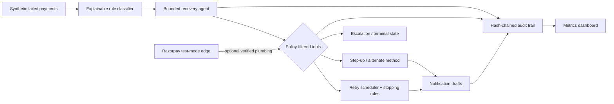

# Mandate Step-up Recovery Agent

Buildathon prototype for detecting failed recurring-payment revenue, diagnosing the failure, and executing a bounded recovery workflow.

This repository does **not** patch Razorpay or reproduce bank-side failures through Razorpay test mode. Failure events are synthetic. Any future Razorpay test-mode integration will demonstrate supported API plumbing only.

## Current status

Checkpoint 1 implements a deterministic synthetic failed-payment generator:

- 100–300 labeled records per batch;
- configurable category distribution;
- integer-paise monetary values;
- card and UPI rails modeled separately;
- ground-truth labels kept separate from runtime-visible fields;
- schema and business-invariant validation;
- reproducible output from a fixed seed.

Checkpoint 2 adds a deterministic root-cause classifier:

- named, ordered rules rather than model scoring;
- structured evidence and a human-readable reason for every prediction;
- runtime-only inputs with evaluation labels stripped first;
- per-category accuracy, confusion matrix, and full mismatch reporting.

Checkpoint 3 adds the bounded recovery agent and paired baseline comparison:

- a fixed seven-tool registry with schema validation;
- category- and state-specific tool permissions;
- hard same-mandate, RuPay, retry-cap, recovery-window, and payment-evidence checks;
- provider-neutral clients for Groq, Ollama, and deterministic simulation/replay;
- compliant agent flow versus an intentionally broken new-mandate baseline;
- paired seeded outcomes, so both strategies face the same latent customer response.

Checkpoint 4 completes the bounded lifecycle around that agent:

- deterministic retry scheduling at 24h and 72h, with a maximum of three total attempts;
- recovery-window and retry-cap stopping rules enforced outside the LLM;
- one-and-only-one follow-up for a missed promise to pay;
- Hinglish notification drafts with every prompt/response pair retained;
- an append-only, SHA-256 hash-chained audit trail;
- optional Razorpay test-mode subscription lookup, Payment Link plumbing for the
  alternate-method path, and webhook signature verification.

Checkpoint 5 adds the live evidence dashboard:

- compliant-versus-naive recovery rate and recovered-value comparison;
- lifecycle recovery, recovery time, root-cause, and honest-exception views;
- audited notification prompt/response samples;
- transaction filtering with a chronological agent decision trace;
- consistency checks that reject summary files which disagree with raw results.

## Architecture



## Generate the checkpoint dataset

Python 3.11 or newer is recommended. Checkpoint 1 uses only the Python standard library.

```bash
python scripts/generate_dataset.py --seed 42 --count 200
```

The command writes a JSONL dataset and prints an inspection summary. To choose a path:

```bash
python scripts/generate_dataset.py --seed 42 --count 200 --output data/generated/my_batch.jsonl
```

## Run tests

```bash
python -m unittest discover -s tests -v
```

## Classify the generated batch

```bash
python scripts/classify_batch.py --run-id checkpoint-2
```

Inspect the resulting files under `data/runs/checkpoint-2/`:

- `classified_transactions.jsonl` contains the runtime transaction, prediction, rule ID, evidence, and evaluation result;
- `classification_metrics.json` contains overall/per-category accuracy, a confusion matrix, and every mismatch.

## Compare compliant and naive recovery flows

The reproducible offline comparison uses the explicitly labeled scripted provider:

```bash
python scripts/compare_flows.py --run-id checkpoint-3 --seed 42 --provider scripted
```

With a Groq free-tier key in `GROQ_API_KEY`, the same bounded agent can use live model tool selection:

```bash
python scripts/compare_flows.py --run-id checkpoint-3-groq --seed 42 --provider groq
```

Use `--provider ollama` for the configured local Ollama endpoint. Provider selection changes who chooses among permitted tools; it does not change tool capabilities or enforcement.

Checkpoint-3 artifacts are written under `data/runs/<run-id>/`:

- `agent_traces.jsonl` — context, tools offered, decision summary, selected tool, validation, and result;
- `compliant_results.jsonl` and `naive_results.jsonl` — paired transaction outcomes;
- `comparison_metrics.json` — recovery count/rate, recovered paise, time, and delta.

All recovery outcomes and headline numbers in this prototype are generated from documented synthetic probabilities. They are demonstration measurements, not claims about production recovery performance.

## Run the complete checkpoint-4 lifecycle

The review-safe offline command is deterministic and needs no API credentials:

```bash
python scripts/run_recovery.py --run-id checkpoint-4 --seed 42 --decision-provider scripted --notification-provider template
```

Inspect `data/runs/checkpoint-4/` after it finishes:

- `lifecycle_summary.json` — recovered count/rate/value, average recovery time,
  final states, unresolved reasons, and audit verification;
- `lifecycle_results.jsonl` — one final outcome per transaction;
- `notifications.jsonl` — Hinglish drafts plus provider/model, prompt, response,
  and safety-validation status;
- `audit_events.jsonl` — classification, agent rationale/tool choice, retries,
  notifications, promise transitions, escalations, and terminal states linked by
  a tamper-evident hash chain.

Verify the persisted audit independently:

```bash
python scripts/verify_audit.py data/runs/checkpoint-4/audit_events.jsonl
```

Seed 42 currently recovers 131 of 200 transactions (65.5%), representing
INR 2,383,472.00 of synthetic revenue. The run also leaves 52 escalated and 17
unrecoverable records visible instead of hiding unsuccessful cases.

For the judged demo, set `GROQ_API_KEY` and switch either or both providers:

```bash
python scripts/run_recovery.py --run-id checkpoint-4-groq --seed 42 --decision-provider groq --notification-provider groq
```

Groq only selects from tools the policy layer exposes and drafts notification
text. Retry caps, windows, RuPay restrictions, same-mandate checks, sensitive-text
validation, and terminal-state evidence remain enforced in deterministic code.

## Optional Razorpay test-mode plumbing

Copy `.env.example` to `.env` and fill its values, using only `rzp_test_`
credentials. Local scripts load `.env` automatically without overriding values
already supplied by the host environment.

Run the credential-safe combined check (two Groq calls plus a read-only Razorpay
Payment Link listing):

```bash
python scripts/demo_integrations_smoke.py
```

To create exactly one INR 1 Standard Payment Link in Razorpay Test Mode for the
alternate-method demo:

```bash
python scripts/demo_integrations_smoke.py --create-payment-link
```

The command reports provider/model, selected bounded tool, notification safety
status, and safe Razorpay entity identifiers. It never prints API credentials.

To confirm an existing test subscription can be read:

```bash
python scripts/razorpay_test_smoke.py --subscription-id sub_your_test_id
```

The integration module can also create a test Payment Link for the RuPay
alternate-method path, and verifies Razorpay webhook HMAC signatures before
normalizing subscription events. These calls are deliberately not part of the
synthetic batch metric: Razorpay test mode cannot reproduce the bank-side AFA
failure, and a Payment Link must not be presented as same-mandate AFA approval.

## Run and deploy the Razorpay webhook receiver

The FastAPI service accepts only signed `subscription.pending`,
`subscription.charged`, `subscription.halted`, and `subscription.activated`
events. It verifies the untouched request body before parsing, deduplicates via
`x-razorpay-event-id`, and stores normalized event fields in SQLite.

Set a separate webhook secret in `.env`, then run locally:

```bash
python -m uvicorn api.app:app --host 127.0.0.1 --port 8000
```

In another terminal, send a correctly signed probe:

```bash
python scripts/send_test_webhook.py
```

The committed `render.yaml` describes a Render web service. In Render, create a
new Blueprint from this repository and enter `RAZORPAY_WEBHOOK_SECRET` when
prompted. Do not upload `.env`. After deployment, verify:

```bash
python scripts/send_test_webhook.py --url https://YOUR-SERVICE.onrender.com/webhooks/razorpay
```

Then create the Test Mode webhook in Razorpay with:

- URL: `https://YOUR-SERVICE.onrender.com/webhooks/razorpay`
- Secret: exactly the `RAZORPAY_WEBHOOK_SECRET` configured on Render
- Events: `subscription.pending`, `subscription.charged`,
  `subscription.halted`, and `subscription.activated`

The free deployment uses ephemeral SQLite storage, suitable for the judged demo
but not production durability. A restart can clear its deduplication history;
production should attach persistent storage or use a managed database.

## Run the checkpoint-5 dashboard

Install the UI dependency and generate both evidence runs:

```bash
python -m pip install -r requirements.txt
python scripts/compare_flows.py --run-id checkpoint-3 --seed 42 --provider scripted
python scripts/run_recovery.py --run-id checkpoint-4 --seed 42
```

Start the dashboard:

```bash
python -m streamlit run dashboard/app.py
```

Open `http://localhost:8501`. The dashboard computes every displayed value from
the JSON/JSONL files under `data/runs/checkpoint-3/` and
`data/runs/checkpoint-4/`; it contains no hardcoded recovery metrics. If files
are missing or inconsistent, it shows the exact preparation commands instead of
silently presenting stale numbers.

## Evaluation-label boundary

Each stored synthetic record contains answer-key fields such as `failure_category`, `correct_action`, and `ground_truth_recoverable`. They exist only to evaluate later checkpoints. `SyntheticTransaction.to_runtime_dict()` strips these fields before classification or orchestration.

The classifier and recovery agent must infer their decisions from observable fields such as amount, mandate ceiling, payment rail, card network, decline code, and prior attempts. Reading the answer-key fields at runtime would be label leakage and would invalidate the evaluation.

See [project assumptions](docs/assumptions.md) for the decisions made from the brief.
